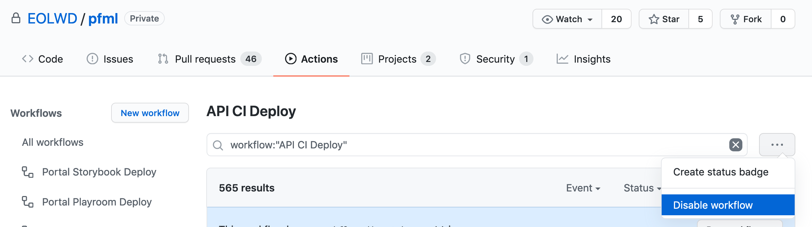
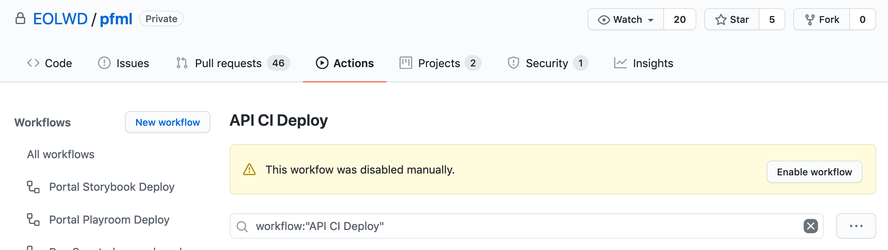

# Deployment

Deployments to all environments are managed through GitHub Actions.

The `master` branch is automatically deployed to `test` as pull requests are merged into it.

Unlike deployments to `test`, all deployments to `training, performance, stage` and `prod` are triggered manually.

---

## Triggering a deployment

To deploy the portal:

- Visit [the Portal Deploy action homepage](https://github.com/EOLWD/pfml/actions?query=workflow%3A%22Portal+deploy%22) on GitHub.

- Click the "Run workflow" button, and fill in the inputs:
    - For the "Use workflow from" dropdown, select the **deployment branch** corresponding to your target environment using the table below.
    This input identifies the environment you will be deploying to.
    - For the second input, provide a `version` to deploy. A `version` can be either the name of a git tag, or the name of any git branch.

- Click the green "Run workflow" button.

### Branch-to-environment mapping

> In the past, pushes to these 'deployment branches' were the triggering event that caused new deployments to begin.
Today, these branches serve an archival role: they record what commit was deployed to which environment at what time.

| Name of deployment branch    | Corresponding env |
| ---------------------------- | ----------------- |
| master                       | test              |
| deploy/portal/stage          | stage             |
| deploy/portal/prod           | prod              |
| deploy/portal/performance    | performance       |
| deploy/portal/training       | training          |

### Communications

If you are testing a feature branch on the test environment, please go through the following additional steps:	

- Communicate to #mass-pfml-engineering. "⚠️ I'll be using the Portal test environment soon, please let me know if you have any concerns."	
- After running the workflow, click the "Disable Workflow" button (see below) to prevent auto-deploys from overriding your deployment.	
- After testing is finished, click the "Enable Workflow" button and update the Slack channel.	

	

---

## Storybook

The [Storybook site](http://massgov-pfml-test-storybook-builds.s3-website-us-east-1.amazonaws.com),
used for visualizing our components, is exported and deployed automatically when pull requests are merged
into the `master` branch. Only one environment (`test`) exists for the Storybook site.

## Playroom

The [Playroom site](http://massgov-pfml-test-playroom-builds.s3-website-us-east-1.amazonaws.com),
used for prototyping in the browser, is exported and deployed automatically when pull requests are merged
into the `master` branch. Only one environment (`test`) exists for the Playroom site.
