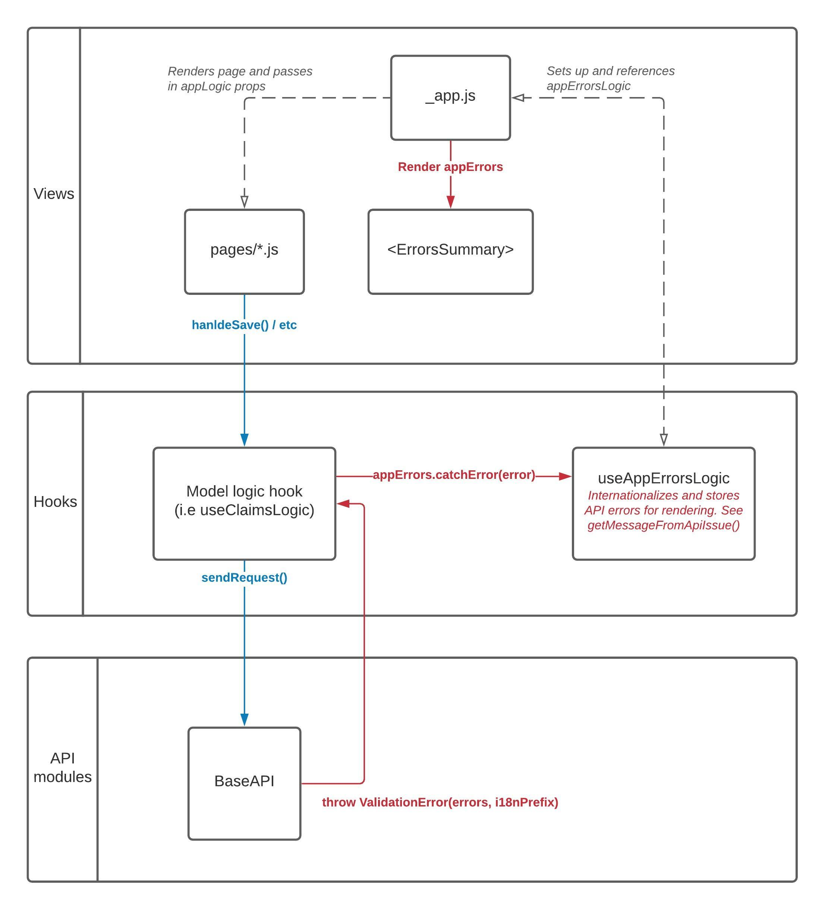

# Error handling

All API requests flow through a "logic hook", which sends the request through the `BaseAPI` module. The `BaseAPI` module is then responsible for processing the response.

Below is a visual representing the flow of a request and how an API error response flows back through the app and is rendered to the user:



## BaseAPI

The normal API error response includes an `errors` property in its body representing the request's issues. When `errors` are present, the `BaseAPI` throws a `ValidationError` that holds all API errors that were in the response body. The `BaseAPI` may also throw other error types, such as `NotFoundError` or `ForbiddenError`, depending on the response's status code.

## Logic hook

The logic hooks, like `useBenefitsApplicationsLogic`, are responsible for catching any errors thrown by the API module and sending the error into `errorsLogic`. A typical pattern for this looks like:

```js
async updateClaim(patchData) {
  try {
    // Send the API request
    await myApi.update(patchData)
  } catch (error) {
    // Handle any API errors
    errorsLogic.catchError(error)
  }
}
```

## App Errors Logic hook

The `useErrorsLogic` hook is where errors get sent to for processing and storing.

When `errorsLogic.catchError` receives a `ValidationError` holding the API response's errors, it parses each API error and creates an `ErrorInfo` instance with a `message` generated from the API issue's `type`, `rule`, and `field` properties. See the `getMessageFromApiIssue` method for how i18n keys are generated.

If you're unsure what i18n key will be generated for the issue, you can trigger the error in local development and view the console to see what key it says is missing:


If a matching i18n key isn't found for the API issue, the app falls back to the original error message sent from the API. We should always have an internationalized error message, and this fallback behavior should not be relied upon.

## `<ErrorsSummary>`

The `ErrorsSummary` component is rendered by our app container (`_app.js`) above the page component.

When the `errorsLogic` module has errors present, the `ErrorsSummary` component renders each error's `message`.

## Inline errors

Each page has access to `errorsLogic` via the `appLogic` prop. The errors can be read from `appLogic.errors`.

If the errors are associated with a specific field on the page, you can render them inline by setting the field component's `errorMsg` prop. The easiest way to do this is by using the `useFunctionalInputProps` to set the common props for your fields, one of which is `errorMsg`.

A common pattern for forms in our app looks like this:

```jsx
const { formState, updateFields } = useFormState({
  first_name: claim.first_name,
});

const getFunctionalInputProps = useFunctionalInputProps({
  errors: props.appLogic.errors,
  formState,
  updateFields,
});

return (
  <form>
    <InputText
      {...getFunctionalInputProps("first_name")}
      label={t("pages.claimsName.firstNameLabel")}
    />
  </form>
);
```

Alternatively, if you're not using `useFunctionalInputProps`, you can use `ErrorInfo.fieldErrorMessage(fieldName)` to return the error message for a specific field:

```jsx
<InputText
  errorMsg={ErrorInfo.fieldErrorMessage(errors, "first_name")}
  name="first_name"
  ...
```
