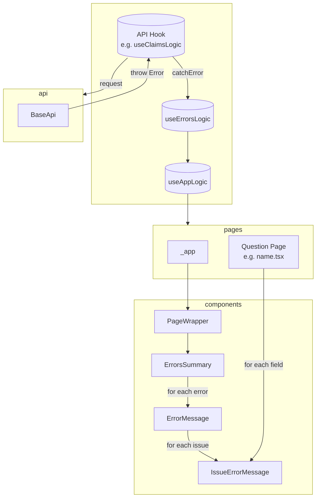
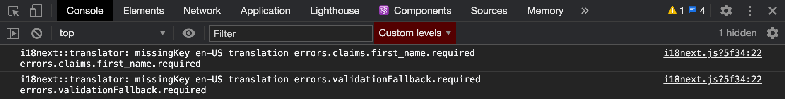

# Error handling

> **TLDR**:
>
> - `useErrorsLogic` is source of truth for errors state management.
> - Portal i18n files are source of truth for error messages, not the API.

Below represents the flow of a request and how an API error response flows back through the app and is rendered to the user:



## Error classes

Errors are represented by subclasses of the [global `Error` object](https://developer.mozilla.org/en-US/docs/web/javascript/reference/global_objects/error). See [`errors.ts`](../../portal/src/errors.ts).

## BaseAPI

Unsuccessful API requests, due to system or validation errors, will receive an `errors` array in the response body. When `errors` are present, the `BaseAPI` module throws a `ValidationError`. This `ValidationError` includes an `issues` field which stores the API response's `errors`.

If no `errors` were present on the API error response body, the `BaseAPI` module will throw an error based on the response status code, such as `NotFoundError`, `ForbiddenError`, etc.

## API hooks

API hooks, like `useClaimsLogic`, are responsible for catching any errors thrown by the API request. A typical pattern for this looks like:

```js
async updateClaim(patchData) {
  try {
    // Send the API request
    await myApi.update(patchData)
  } catch (error) {
    // Handle any API errors
    errorsLogic.catchError(error)
  }
}
```

## Errors hook

The `useErrorsLogic` hook is the source of truth for errors state management.

To handle an error and display its message in the UI, call the error logic hook's `catchError` method. Custom handlers can be added for specific error subclasses, if necessary.

## Error messages & internationalization (i18n)

**All error messages should be internationalized.** This means every error message should have a key/value mapping in the `errors` object of our [internationalization](./internationalization.md) file(s), and we shouldn't rely on the default error message defined on the API's error response.

### I18n keys

The i18n keys for error messages are automatically generated, based on:

1. Which API endpoint the error is thrown from
1. The error instance type (e.g. `ValidationError`, `NotFoundError`, etc.)
1. And if the error has an `issues` field, then the issue's `type`, `field` and `rule` properties.

The logic for the last point above is somewhat difficult to describe in plain language, so it may be easier to reference the code itself: check out [`getI18nKeysForIssue` in the `IssueErrorMessage` component](../../portal/src/components/IssueErrorMessage.tsx).

If you're unsure what i18n keys will be generated for an issue, you can trigger the error in local development and view the console to see what keys it makes available:



If an i18n key isn't found for the API issue, the app falls back to the original error message sent from the API. But again, we should always have an internationalized error message, and this fallback behavior should not be relied upon.

### Links and HTML in error messages

Error messages support a subset of HTML elements and links. To safelist a new HTML element or link, update the object in `useErrorI18nComponents`.

### UI Components

Various UI components are responsible for internationalizing and displaying errors to the user. Below is a quick summary. View additional details and examples in Storybook.

- `<ErrorsSummary>` is part of our global page layout. When errors are present, it lists every error. Its heading is dynamic, based on the number of errors.
- `<IssueErrorMessage>` - Given an entry in an error's `issues` array, this component renders a single internationalized message.

### Inline errors

Each page has access to `errorsLogic` via the default `appLogic` prop.

If an error includes an `issues` entry that is associated with a specific field on the page, you can render the issue's message inline by setting the field component's `errorMsg` prop.

The easiest way to do this is by using the `useFunctionalInputProps` hook to set the common props for your fields, one of which is `errorMsg`.

A common pattern for forms in our app looks like this:

```jsx
const { formState, updateFields } = useFormState({
  first_name: claim.first_name,
});

const getFunctionalInputProps = useFunctionalInputProps({
  errors: props.appLogic.errors,
  formState,
  updateFields,
});

return (
  <form>
    <InputText
      {...getFunctionalInputProps("first_name")}
      label={t("pages.claimsName.firstNameLabel")}
    />
  </form>
);
```

Alternatively, if you're not using `useFunctionalInputProps`, you can use the `findErrorMessageForField` utility to return the message for a specific field:

```jsx
<InputText
  errorMsg={findErrorMessageForField(errors, "first_name")}
  name="first_name"
  ...
```
