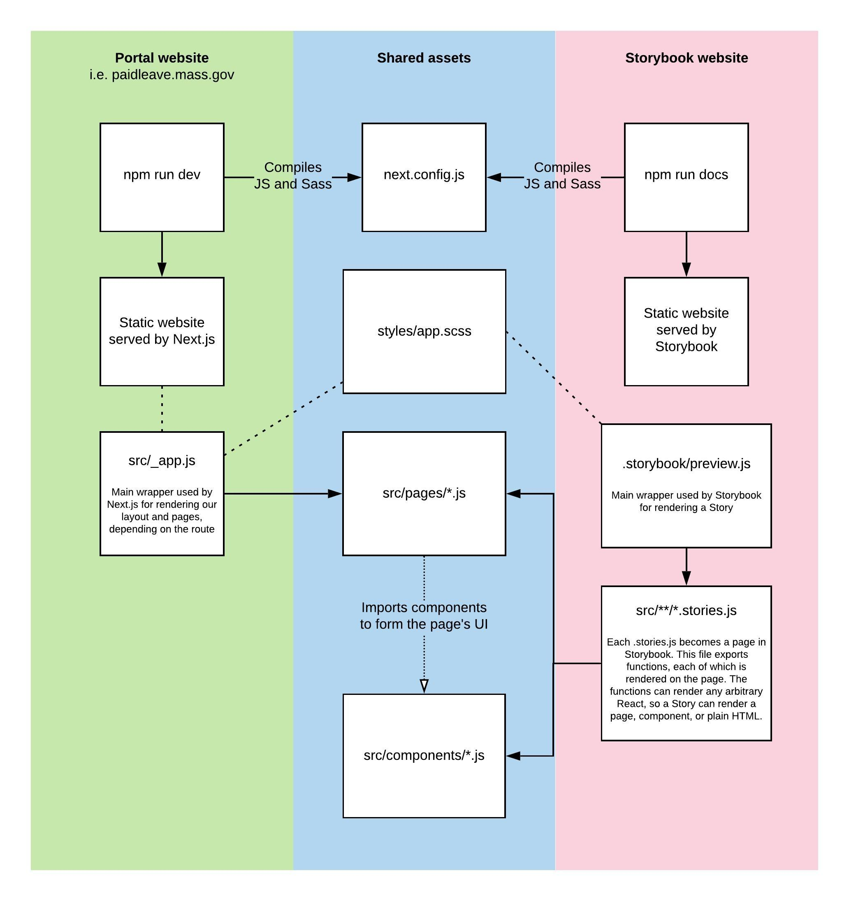

# Storybook

[Storybook](https://storybook.js.org/) is a tool for UI development. It makes development faster and easier by isolating components. This allows you to work on one component at a time. You can develop entire UIs without needing to run the Portal application, or navigating around the Portal flow. You can read more below about the process and collaboration goals behind our usage of Storybook.

The ultimate output is a static site that [currently gets deployed here](http://pfml-storybook.nava.pizza/). (Related: [Deploy docs](deployment.md))

## Contributing to Storybook

First: The [Storybook docs](https://storybook.js.org/docs/react/get-started/introduction) are great. If your question isn't answered in this doc, it's likely answered in their docs. This doc is more of a TLDR to get you started contributing to our Storybook.

Developers can run Storybook locally by running:

```sh
npm run docs
```

### Adding a new story

Each page in Storybook is generated from `*.stories.js` files located in [`portal/storybook/stories/`](../../portal/storybook/stories/). This file exports functions (["stories"](https://storybook.js.org/docs/react/get-started/whats-a-story)), each of which is rendered on the page. The functions can render any arbitrary React, so a Story can render a page, component, or plain HTML.

For example, here's a Storybook page with a single story that renders a preview of our Button component:

```jsx
// portal/storybook/stories/components/Button.stories.js
import Button from "src/components/Button";
import React from "react";

export default {
  // this determines where the story shows in the site's sidebar menu:
  title: "Components/Button",
  // this is used to generate the props table on the page:
  component: Button,
  // these are passed into each story and enable nifty
  // live editing in the site's UI:
  args: {
    children: "Save and continue",
    handleClick: () => alert("Clicked!"),
  },
};

export const Primary = (args) => {
  return <Button {...args} />;
};
```

**[Learn more about writing stories →](https://storybook.js.org/docs/react/writing-stories/introduction)**

### Previewing entire pages

In Next.js, [a page is just a React component](https://nextjs.org/docs/basic-features/pages). This enables some pretty cool capabilities when combined with Storybook. Specifically, this means we can create a Story that renders a Page component, which allows us to preview an entire page without navigating through the entire application flow to preview the page.

For the Create Claim flow, we're [generating a Storybook page for each page in the flow](../../portal/bin/generate-claims-page-stories.js). Engineers can override the generated story by adding a `*.stories.js` file for the page in the `storybook/stories/pages/applications` directory.

### How Storybook interacts with our source code

Storybook stories import and render the same components used in the live site. Below is a visualization attempting to demonstrate how assets are shared between our web application and the Storybook site.



## For engineers

For the engineering team, Storybook provides a place to document components and also provides a place outside of our Next.js app to preview new components being developed.

For engineers, Storybook aims to answer questions like:

- What components exist?
- How does this component behave when rendered?
- What is this component for?
- What props does this component expect?

Engineers could also look at the source code to answer most of these questions, but Storybook provides a friendly UI to answer them. It also provides a mechanism for producing smaller pull requests — for instance, rather than creating a component and connecting it to our application logic, an engineer could first create a pull request that adds just the component and a corresponding Storybook story for previewing the component.

## For designers

There's also a world where Storybook can be used as a shared tool, supporting a more collaborative workflow between Engineering, Design, and Product teams. One goal is to have a source of truth for design pattern documentation and guidance. Ideally that lives close to the actual implementation of the patterns. The goals for Storybook in this case would be to answer the questions above, as well as questions like:

- Why does this design pattern exist? What problems is it addressing?
- What does this design pattern look like at different screen sizes?
- What have we learned about this pattern through user research? How has it evolved?

This may mean that some Storybook pages are more in-depth than others. These more extensive documentation pages would be a collaboration between Engineering and Design. Engineering's role might be: code the components and setup the Storybook page with an example of the component. It would then be Design's role to contribute design documentation, like any decisions or research that fed into the creation of the pattern, or guidance on different ways the component should be used. There may be times when Engineering and Design pair on a Storybook page to ensure the implementation achieves the intended design.
