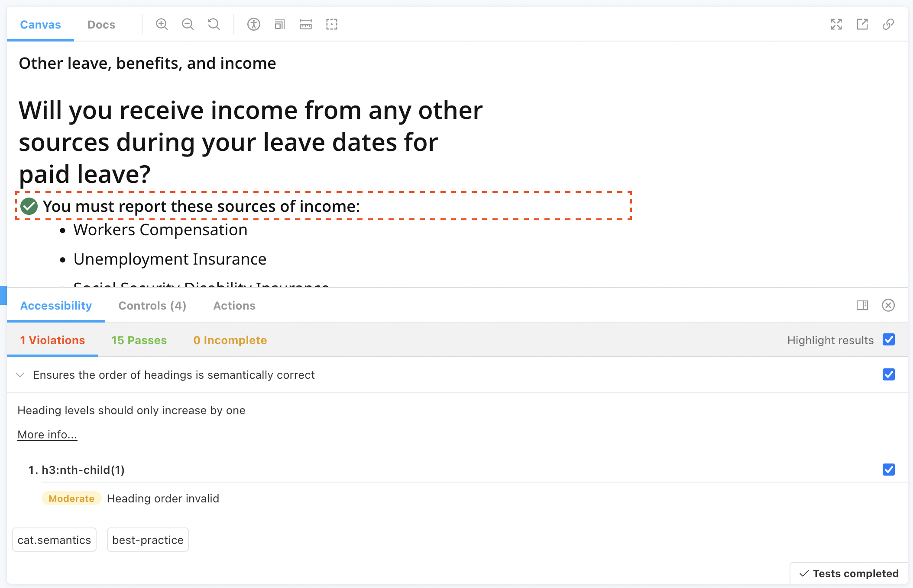

# Tests

## Introduction

[Jest](https://jestjs.io/) is used as our JS test runner and is very similar to Jasmine. We also use [jest-dom](https://github.com/testing-library/jest-dom) custom matchers.

**Read the [Jest documentation](https://jestjs.io/en/) to learn how to write assertions.** A good place to start if you are new to JS testing is to learn about [Using Matchers](https://jestjs.io/docs/en/using-matchers).

Below is an example of a test:

```js
import sum from "./sum";

describe("sum", () => {
  it("adds 1 + 2 to equal 3", () => {
    const result = sum(1, 2);

    expect(result).toBe(3);
  });
});
```

## Creating new test files

A test file should be placed in the appropriate `tests` directory (e.g. `portal/tests`) rather than alongside the file it tests. These test files should have the same name as the file they're testing, and have `.test.tsx` as the extension. For example, `pages/index.tsx` and `tests/pages/index.test.tsx`.

> You'll notice some existing test files written in `.js`. These were created before we migrated the codebase to TypeScript. We recommend that any new tests be written in TypeScript, in order to reduce the introduction of more `.js` files into the codebase.

## Unit tests

We use [React Testing Library](https://testing-library.com/docs/react-testing-library/intro/) alongside Jest. React Testing Library (RTL), enables us to interact with rendered DOM nodes directly in our tests. This helps us to write tests that resemble the way our software is used (more on that in the [RTL guiding principles](https://testing-library.com/docs/guiding-principles)).

**React Testing Library Resources:**

- [React Testing Library Docs](https://testing-library.com/docs/react-testing-library/intro/)
- [Cheatsheet guide](https://testing-library.com/docs/react-testing-library/cheatsheet/) to reference all the available React Testing Library fucntions
- [Playground](https://testing-playground.com/) to test out your queries

Below is an example of a React component test:

```js
import { fireEvent, render, screen } from "@testing-library/react";
import Button from "./Button";

describe("Button", () => {
  it("is clickable", () => {
    const onClickHandler = jest.fn();
    render(<Button onClick={onClickHandler}>Click me</Button>);
    fireEvent.click(screen.getByText(/Click me/));
    expect(onClickHandler).toHaveBeenCalled();
  });
});
```

### Snapshot tests

[Snapshot tests](https://jestjs.io/docs/en/snapshot-testing) are useful for testing when a React component or JSON output changes unexpectedly.

A typical snapshot test case is to render a UI component, take a snapshot, then compares it to the last snapshot that was taken. The test will fail if the two snapshots do not match.

If a snapshot test fails, you should identify whether it failed because the change was unexpected. If it was an unexpected change, then you may have unintentionally broke an expected behavior, in which case you should investigate and fix it before sending the PR out for review. If it failed because you intentionally changed something related to the test, then the snapshot should be updated to reflect the intended change.

To update snapshots, run:

```
npm run test:update-snapshots
```

[Learn more about Snapshot Testing.](https://jestjs.io/docs/en/snapshot-testing)

#### JSON snapshot example

```js
it("renders the fields with the expected content and attributes", () => {
  const output = callMethodAndReturnJSON();

  // You can use inline snapshots if the output is fairly short:
  expect(output).toMatchInlineSnapshot();
});
```

#### React snapshot example

```js
it("renders the component as expected", () => {
  const { container } = render(<ExampleComponent />);

  expect(container.firstChild).toMatchSnapshot();
});
```

### Mocks

Mock functions make it easy to test the links between code by erasing the actual implementation of a function, capturing calls to the function (and the parameters passed in those calls), capturing instances of constructor functions when instantiated with new, and allowing test-time configuration of return values.

The quickest way to mock a module is to call `jest.mock('MODULE_NAME_HERE')` at the top of your test file.

To create a manual mock of a Node module, create a file in a top-level `__mocks__` directory.

You can also create a Mock function/spy using `jest.fn()`

[Learn more about Mock Functions](https://jestjs.io/docs/en/mock-functions).

### Test coverage

Jest includes [built-in support for measuring test coverage](https://jestjs.io/docs/en/cli#coverage), using [Istanbul](https://istanbul.js.org/). The [`coverageReporters`](https://jestjs.io/docs/en/configuration#coveragereporters-array-string) Jest setting can be modified for more advanced test coverage use cases.

## Storybook and Accessibility tests

A test is generated for each story in the Storybook. The test asserts:

1. The story renders without crashing
2. The story has no accessibility violations.

### Accessibility tests

We use [`jest-axe`](https://github.com/nickcolley/jest-axe) to run automated accessibility tests. **You shouldn't rely heavily on these tests.** The Accessibility team from the UK Government Digital Service (GDS) found that [only ~30% of issues are found by automated testing](https://accessibility.blog.gov.uk/2017/02/24/what-we-found-when-we-tested-tools-on-the-worlds-least-accessible-webpage).

For the most part, you can rely on the generated Storybook test to run the accessibility tests. The error reports can sometimes make it difficult to identify what aspect of the page it's referring to. In these cases, it can be easier to view the Accessibility tab in the Storybook UI, where you can then toggle highlighting of the offending element(s):



If you want to introduce a unique test that's not dependent on Storybook, you can add your own accessibility assertion. For example:

```tsx
// tests/pages/index.test.tsx
import Page from "src/pages/index";
import { axe } from "jest-axe";
import { render } from "@testing-library/react";

it("renders page without accessibility violations", async () => {
  const { container } = render(<Page />);
  const results = await axe(container);

  expect(results).toHaveNoViolations();
});
```
