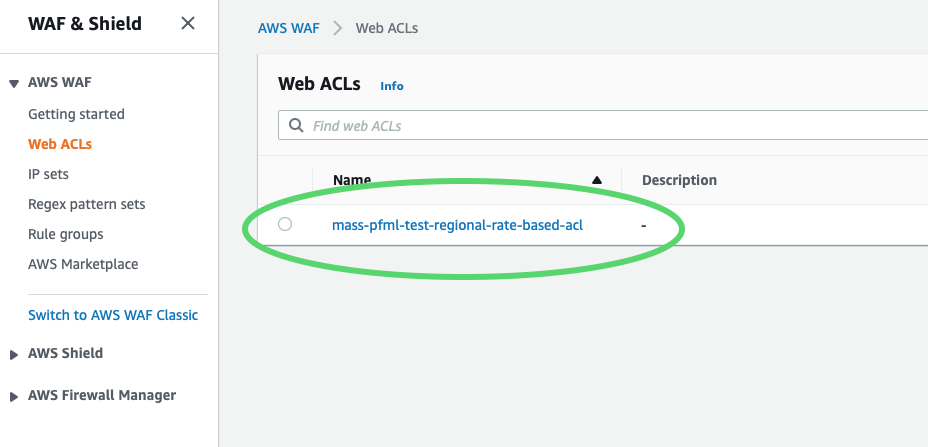
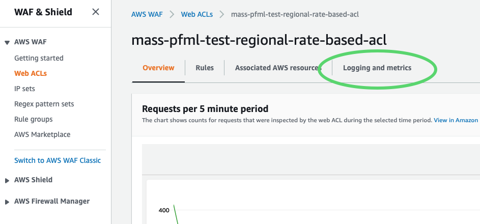
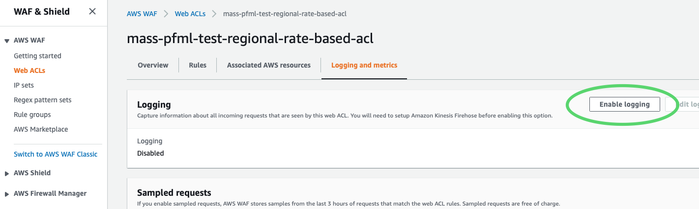
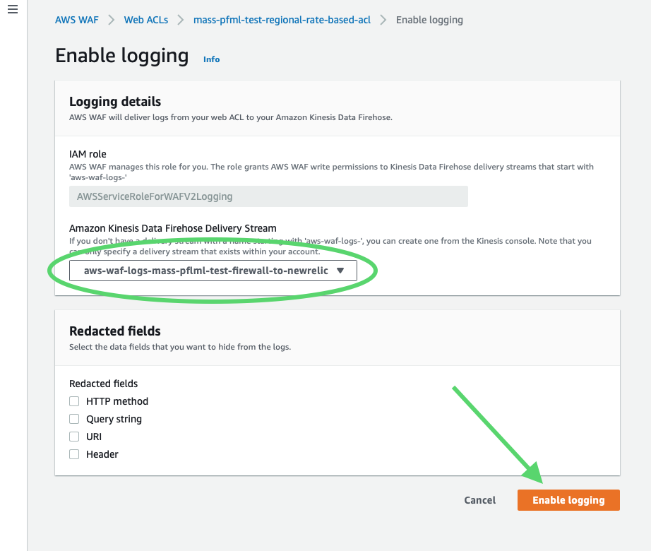
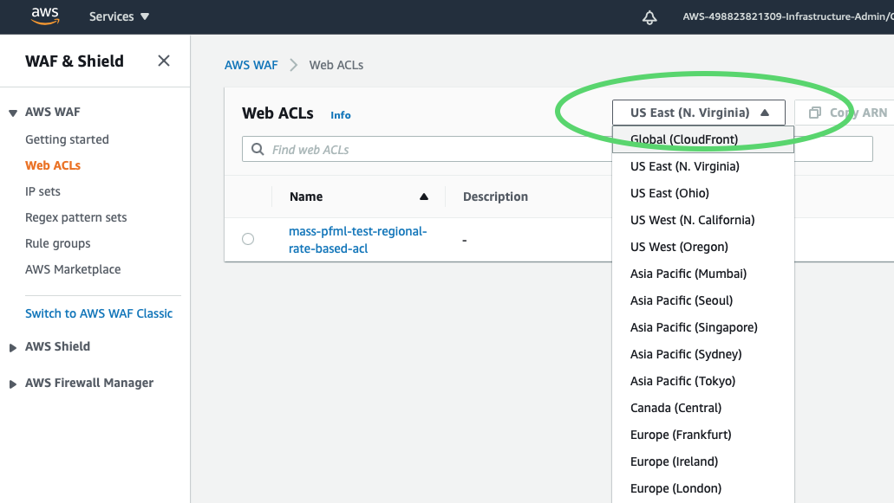
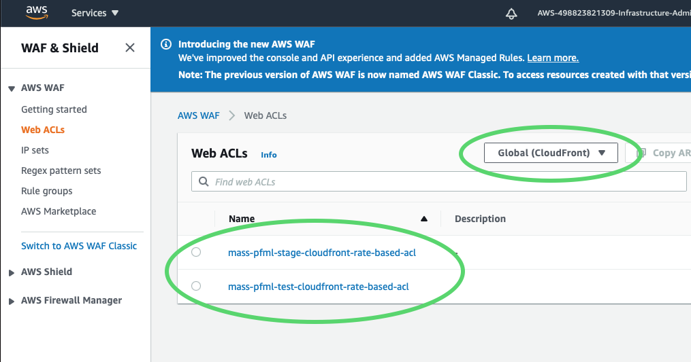

# Create Kinesis Data Firehose stream and connect to AWS WAF

As of 10 Dec 2020, creating the KDF in terraform presents a [security risk][terraform issue]. This document describes the current practice for creating a Kinesis Data Firehose stream and connecting it to the AWS WAF in each environment.

## The following resources (contained in this folder) are created with Terraform

1. The IAM role and policy for future KDF to use
2. The S3 bucket for KDF dead-letter drop for data that failed to send to HTTP endpoint
3. The KMS key the future KDF to encrypt/decrypt data in the S3 dead-letter drop

To create these resources run `terraform apply` in  
`pfml/infra/env-shared/environments/<environment name>`

## Create the KDF in the AWS console and connect it to terraform-created resources

-*Go to the [KDF creation wizard][KDF creation page] and follow these steps**

### Step 1: Name and source

- Delivery stream name -  **aws-waf-logs-mass-pflml-\<environment name\>-firewall-to-newrelic**
  - **The* `aws-waf-logs-` *prefix is required by AWS*
- Source -  **Direct PUT or other sources**
- Enable encryption -  **yes**
- Choose **Use customer managed CMK**
- In the dropdown menu, look for `"Alias: mass-pfml-\<environment name\>-kinesis-s3-key"` (under the key id) and select.
- Find the blue **Next** button at the bottom of the screen and click.
  
### Step 2. Process records

- Data transformation -  **Disabled**
- Record format conversion -  **Disabled**
- Click **Next**

### Step 3. Choose a destination

- Destination -  **Third-party service provider**
- The "Third-party service provider" dropdown will appear. Choose **New Relic**
- HTTP endpoint URL - `https://aws-api.newrelic.com/firehose/v1`
- For the "API key" field
  - In another tab, in AWS Console, go to [AWS Systems Manager > Parameter Store][parameter store]
  - Search for `newrelic`
  - Click on **/admin/pfml-api/newrelic-api-key**
  - On the bottom of the description, underneath "Value," click **show**
  - Copy the key value
  - Go back to the KDF creation wizard tab
  - Paste key value into the text field under **Access key - *optional***
- Content encoding - **GZIP**
- Retry duration -  **60** (default)
- S3 backup mode -  **Failed data only**
- S3 bucket -  In the dropdown, choose **massgov-pfml-\<environment name\>-kinesis-dead-letter-drop**
- Backup S3 bucket error prefix: **leave blank**
- Click **Next**
  
### Step 4. Configure settings

- **New Relic buffer conditions** (AWS recommendations for New Relic HTTP endpoint)
  - Buffer size -  **15**
  - Buffer interval -  **600**
- **S3 buffer conditions**
  - Buffer size -  **10**
  - Buffer interval -  **400**
- **S3 compression and encryption**
  - S3 compression -  **GZIP**
  - S3 encryption -  **enabled**
  - The "KMS master key" dropdown will appear. Choose **mass-pfml-\<environment name\>-kinesis-s3-key**
- Error logging -  **Disabled** (until we create a CloudWatch resource for this)
- **Permissions**
  - IAM Role -  **Choose existing IAM role**
  - In the **Existing IAM roles** dropdown, choose **mass-pfml-\<environment name\>-kinesis-aws-waf-role**
- Click **Next**

### Step 5. Review

- Do your best review
- :sparkles: Click **Create delivery stream** :sparkles:

## Verify existence of KDF -> New Relic connection

Sign in to New Relic. Click on "Entity explorer" at the top of the page. In the search bar, type "kinesis" and click on **Kinesis delivery stream**. If the `aws-waf-logs-mass-pfml-<environment>-firewall-to-newrelic`
that you just created is there, congratulations! :tada: You did it!

## Connect AWS WAF resources to the KDF stream

First, in the AWS Console, go to [AWS Firewall Manager > AWS WAF > Web ACLs][web acls]  
Then...

### Click on an ACL

### Click on "Logging and metrics"

### Click "Enable logging"

### Choose delivery stream and click "Enable logging"

## Look for data in New Relic

If you see data in your Kinesis delivery stream, you're done with this ACL! Great job! :+1:  

Now...

## Repeat this process for all of the other ACLs in scope

Go back to [AWS Firewall Manager > AWS WAF > Web ACLs][web acls] and do it all again for the ACLs.  

After all of those are complete...

## Find button to swich scope and click on "Global(CloudFront)"

## Repeat "Connect AWS WAF resources to the KDF stream" above for each ACL

---
[KDF creation page]:https://console.aws.amazon.com/firehose/home?region=us-east-1#/wizard/nameAndSource

[terraform issue]:https://github.com/hashicorp/terraform-provider-aws/pull/16684

[parameter store]:https://console.aws.amazon.com/systems-manager/parameters/?region=us-east-1&tab=Table

[web acls]:https://console.aws.amazon.com/wafv2/homev2/web-acls?region=us-east-1
