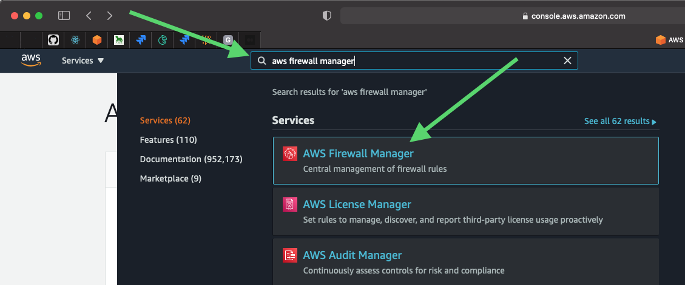
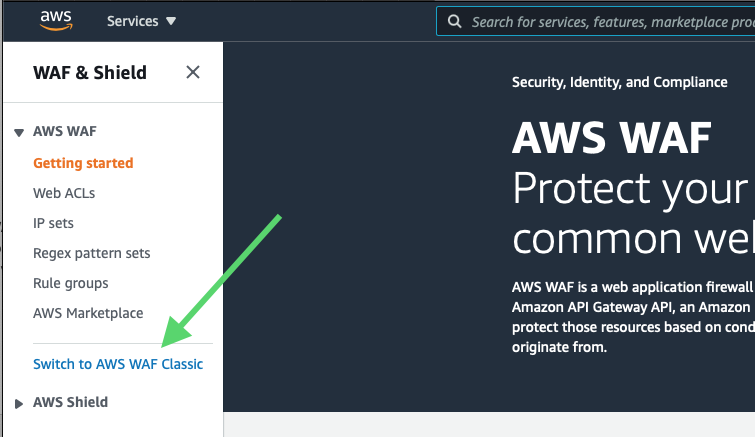
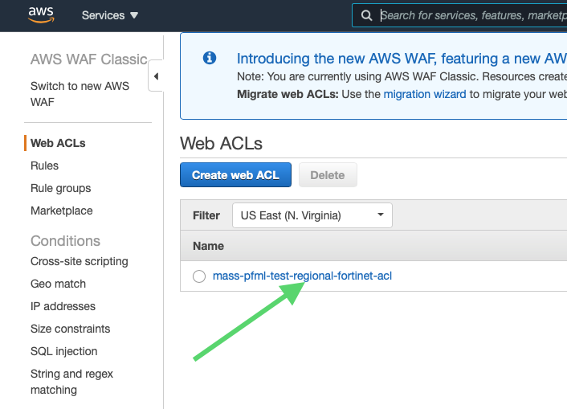
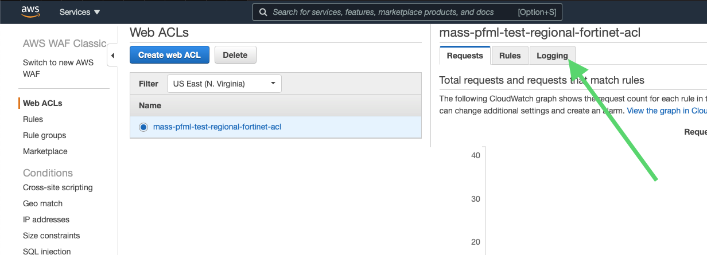
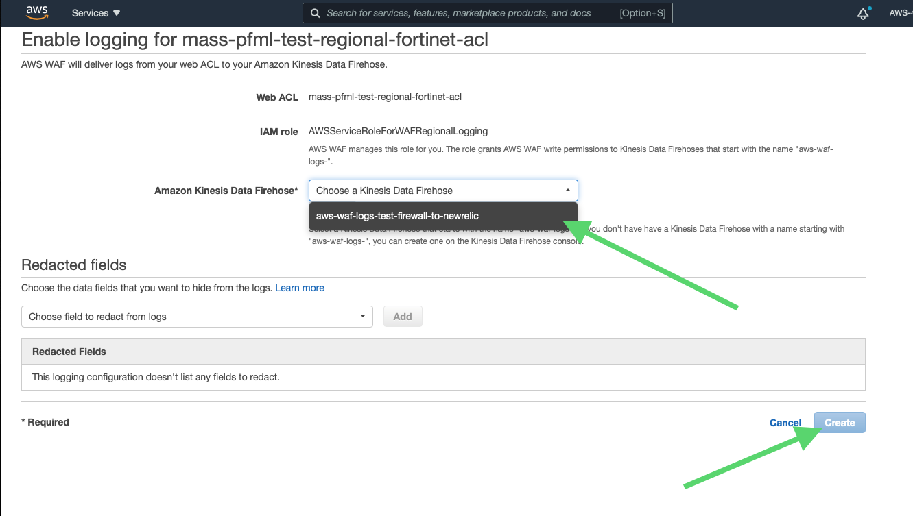

# On Kinesis Data Firehose

Everything needed for creating a Kinesis Data Firehose (KDF) and connecting it  
to an AWS WAF ACL for logging is included in the .tf files in this folder.  
WAFV2 resources, if included in these files (and properly set up), will be  
automatically connected by terraform by running a `terraform apply` command in  
 infra/env_shared/environments/\<environment name\>.

## Special consideration for AWS WAF Classic resources

Terraform does not have an equivalent to `aws_wafv2_web_acl_logging_configuration`  
for AWS WAF Classic ACLs, so these configurations will need to be made using the  
AWS Console. This specifically applies to the __Fortinet Managed Rules__.

### Connecting an AWS WAF Classic resource to the KDF

#### Navigate to AWS Firewall Manager

Enter "AWS Firewall Manager" in the search bar at the top of any AWS Console  
Page and click on AWS Firewall Manager.

#### Go to AWS WAF

Click on "Go to AWS WAF" button  

  

#### Go to AWS WAF Classic

Click on "Switch to AWS WAF Classic"  

  

#### Choose ACL to connect to KDF

Click on the ACL you wish to connect to the KDF

  

#### Edit logging configuration

Click on "Logging" tab  

  

#### Choose KDF to connect AWS WAF Classic ACL to

Click on dropdown menu and click on  
 `aws-waf-logs-\<environment name\>-firewall-to-newrelic`  
 then click "Create" button.

  
